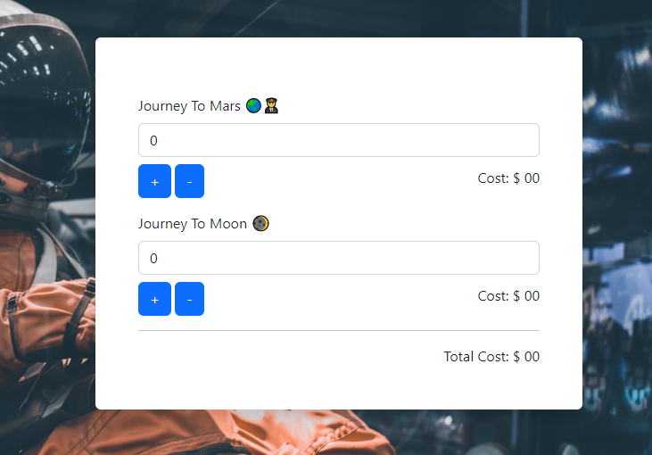

## space-traveler:

- A simple code added.
```javascript
function getInputField(space,cost,increase){

    const marsInput = document.getElementById(space + '-input');
    let marsNumber = marsInput.value;
    if(increase){
         marsNumber = parseInt(marsInput.value) + 1;
    }
    else if(marsNumber>0){
        marsNumber = parseInt(marsInput.value) - 1;
    }
    marsInput.value = marsNumber;

    const marsCost = document.getElementById(space + '-cost');
    let marsCostTotal = parseInt(marsCost.innerText);
    marsCostTotal = marsNumber * cost; 
    marsCost.innerText = marsCostTotal;
    getTheTotalCost()

}

function getCost(space){
    const spaceInput = document.getElementById(space + '-input');
    const spaceSit = parseInt(spaceInput.value);
    return spaceSit;
}

function getTheTotalCost(){
    const mars = getCost('mars') * 1259;
    const moon = getCost('moon') * 1100;

    const total = mars + moon;

    document.getElementById('total-cost').innerText =total;
}


document.getElementById('mars-plus').addEventListener('click',function(){
    /* const marsInput = document.getElementById('mars-input');
    const marsNumber = parseInt(marsInput.value) + 1;
    marsInput.value = marsNumber; */

    getInputField('mars',1259,true)

});

document.getElementById('mars-minus').addEventListener('click',function(){
   /*  const marsInput = document.getElementById('mars-input');
    const marsNumber = parseInt(marsInput.value) - 1;
    marsInput.value = marsNumber; */

    getInputField('mars',1259,false)

});


document.getElementById('moon-plus').addEventListener('click',function(){
 
    getInputField('moon',1100,true)

});

document.getElementById('moon-minus').addEventListener('click',function(){

    getInputField('moon',1100,false)

})
```